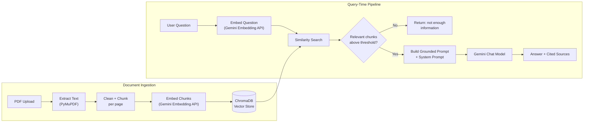

<p align="center">
  
</p>

<h1 align="center">Cura - AI Medical Assistant</h1>

<p align="center">
  A retrieval-augmented chatbot that answers medical questions strictly from your own trusted, indexed documents - never from the model's parametric knowledge.
</p>

<p align="center">
  
  
  
  
  
</p>

> ⚠️ **Disclaimer:** Cura is informational only. It does not diagnose conditions and is not a substitute for professional medical advice, diagnosis, or treatment. For any medical emergency, contact local emergency services immediately.

---

## Table of Contents

- [Overview](#overview)
- [How It Works](#how-it-works)
- [Feature Highlights](#feature-highlights)
- [Tech Stack](#tech-stack)
- [Project Structure](#project-structure)
- [Key Design Decisions](#key-design-decisions)
- [Getting Started](#getting-started)
  - [Prerequisites](#prerequisites)
  - [Installation](#installation)
  - [Configuration](#configuration)
  - [Running Locally](#running-locally)
- [API Reference](#api-reference)
- [Usage Examples](#usage-examples)
- [Testing](#testing)
- [Troubleshooting](#troubleshooting)
- [Known Limitations](#known-limitations)
- [Roadmap](#roadmap)
- [License](#license)

---

## Overview

Cura is a **Retrieval-Augmented Generation (RAG)** system purpose-built for medical Q&A over a curated document set. Rather than relying on an LLM's general training knowledge - which for medical topics can be outdated, unverifiable, or simply wrong - Cura grounds every answer in text retrieved from PDFs you explicitly upload and index.

It was built as a portfolio-grade demonstration of a production-style RAG architecture: a clean service-layer separation, a strict grounded-prompt pipeline, structured exception handling, dependency injection, and a full unit test suite - not just a notebook-to-demo script.

At a glance, Cura:

- Accepts medical PDF documents via a dashboard or the API, extracts and chunks their text, embeds each chunk with the Gemini Embedding API, and stores the vectors in a local ChromaDB collection.
- Embeds incoming user questions and retrieves the most similar stored chunks as context.
- Passes **only** that retrieved context - never open-ended model knowledge - to Gemini, under a system prompt that forbids fabrication and mandates citing sources.
- Refuses to answer, explicitly and safely, when no retrieved chunk is relevant enough to be trustworthy.
- Returns every answer alongside its source filenames, page numbers, and similarity scores for full traceability.

## How It Works



The chat pipeline (`app/rag/chat_pipeline.py`) is the module that guarantees this contract: every question is routed through retrieval and the grounded prompt builder before it can ever reach Gemini, and a fixed cosine-similarity threshold (`0.3`) decides whether retrieved context is trustworthy enough to answer from at all.

## Feature Highlights

- **Grounded answers only.** No chunk clears the relevance bar → Cura returns a fixed "the available documents do not contain enough information" response and skips the Gemini call entirely, rather than guessing.
- **Full source citation.** Every answer returns the contributing filenames, page numbers, and similarity scores as structured data - rendered as citation cards in the dashboard.
- **Developer mode.** An optional flag on `/chat` surfaces the raw retrieved chunk text, useful for debugging retrieval quality during development.
- **Document lifecycle management.** List indexed documents with chunk/page counts, delete a single document, wipe the entire vector store, or re-index everything from the `data/` directory - via API or dashboard.
- **Persisted conversation.** The single running conversation is saved server-side in a local SQLite database, not just in the browser tab - it survives page refreshes, backend restarts, and can be viewed from any browser or device pointed at the same backend.
- **Dependency-injected services.** Gemini, ChromaDB, and PDF extraction are each isolated behind a single service module and wired together with FastAPI's `Depends`, so any one can be swapped or mocked without touching business logic.
- **Structured, safe error handling.** A layered exception hierarchy translates internal failures into precise HTTP status codes, while a catch-all handler ensures the client never sees a raw stack trace.
- **Static, dependency-light dashboard.** A plain HTML/CSS/JS single-page app (no build step, no framework) with a custom dark-green theme, chat bubbles, citation cards, and live Gemini/ChromaDB status indicators.
- **Comprehensive test suite.** Unit tests for chunking, PDF extraction (including password-protected and corrupted-file edge cases), prompt building, retrieval, and the ChromaDB wrapper.

## Tech Stack

| Layer | Technology |
|---|---|
| API framework | [FastAPI](https://fastapi.tiangolo.com/) + Uvicorn |
| LLM & Embeddings | Google Gemini (`google-genai` SDK) |
| Vector store | [ChromaDB](https://www.trychroma.com/) (local, persistent) |
| Conversation history | SQLite (stdlib `sqlite3`, local, persistent) |
| PDF extraction | [PyMuPDF](https://pymupdf.readthedocs.io/) |
| Chunking | `langchain-text-splitters` (`RecursiveCharacterTextSplitter`) |
| Validation & config | Pydantic v2 / `pydantic-settings` |
| Retry handling | `tenacity` |
| Frontend | Static HTML / CSS / vanilla JS (no build step) |
| Testing | `pytest`, `pytest-mock` |

## Folder Structure

```
AI-Medical-Assistant/
├── app/
│   ├── api/             # FastAPI route handlers (thin HTTP layer only)
│   ├── core/            # Logging, exceptions, dependency injection wiring
│   ├── config/          # Centralized settings (reads all env vars)
│   ├── services/        # External I/O boundaries: PDF, Gemini, ChromaDB, conversation history
│   ├── rag/             # Pipeline logic: chunking, retrieval, prompt building, indexing pipeline, chat pipeline
│   ├── models/          # Pydantic API schemas and internal domain dataclasses
│   ├── utils/           # Stateless helpers (text cleaning)
│   ├── prompts/         # Prompt templates as plain text/markdown
│   └── main.py          # FastAPI application entrypoint
├── frontend/
│   ├── index.html       # Dashboard shell (sidebar + chat layout)
│   ├── style.css        # Dark green dashboard theme, 8px spacing system
│   └── app.js           # Dashboard logic (fetch/XHR calls to the API only)
├── data/                # Uploaded PDF storage
├── chroma_db/           # Persistent vector store
├── conversation.db      # Persisted conversation history (SQLite, single file)
├── tests/               # Unit tests for every pipeline component
├── scripts/
│   └── reindex.py       # CLI to rebuild the vector store from data/
├── .env.example         # Template for required environment variables
├── requirements.txt
└── README.md
```

## Key Design Decisions

- **Retrieval is the source of truth.** The chat pipeline always retrieves before generating, and generation happens only against a prompt built exclusively from retrieved chunks plus a strict system prompt (`app/prompts/system_prompt.md`). If no chunk clears the minimum similarity threshold, Cura returns a fixed "not enough information" response and skips the Gemini call entirely.
- **Per-page chunking.** Chunking runs per PDF page rather than on concatenated document text, so every chunk carries an accurate, single page number in its metadata - required for source citation. The tradeoff: a semantic unit spanning a page break may be split into two chunks; the configured overlap mitigates most of the resulting context loss.
- **Isolated service boundaries.** `pdf_service.py`, `gemini_service.py`, and `chroma_service.py` are the only modules that import their respective third-party libraries. Swapping PyMuPDF, Gemini, or ChromaDB for an alternative requires changing only that one file.
- **Dependency injection over global state.** Services are constructed via cached provider functions in `app/core/dependencies.py` and injected into FastAPI routes with `Depends`, rather than instantiated as module-level globals.
- **Backend-persisted, single conversation, no session model.** Conversation history lives in the server's SQLite database, not the browser - by design, there is exactly one conversation for the whole app, with no conversation IDs, session tokens, or multi-chat switcher. This was a deliberate scope choice: it keeps the storage layer to a single flat table and the API surface to two endpoints (`GET`/`DELETE /conversation`), at the cost of not supporting multiple named/parallel conversations. Saving to browser `localStorage` instead was considered and rejected, since it would not survive switching browsers or devices, and both were explicit requirements.
- **Static frontend, no build step.** The dashboard is plain HTML/CSS/JS rather than Streamlit or a compiled framework, giving full control over the visual design without a bundler. It is a pure client: every piece of actual logic goes through a fetch/XHR call to the FastAPI backend, and the API's permissive CORS policy (see [Known Limitations](#known-limitations)) is what makes that possible when the two are served from different local ports.

## Getting Started

### Prerequisites

- Python 3.11+
- A Google Gemini API key ([Google AI Studio](https://aistudio.google.com/apikey))
- `pip` and a virtual environment tool (`venv` is used below)

### Installation

```bash
git clone <this-repository-url>
cd AI-Medical-Assistant
python -m venv .venv
source .venv/bin/activate    # Windows: .venv\Scripts\activate
pip install -r requirements.txt
```

### Configuration

All configuration is read from environment variables (or a local `.env` file) via `app/config/settings.py`. Copy the template and fill in your key:

```bash
cp .env.example .env
```

| Variable | Description | Default |
|---|---|---|
| `GEMINI_API_KEY` | Gemini API key (required) | - |
| `MODEL_NAME` | Gemini chat model | `gemini-3.6-flash` |
| `EMBEDDING_MODEL` | Gemini embedding model | `gemini-embedding-001` |
| `CHROMA_PATH` | ChromaDB persistence directory | `./chroma_db` |
| `CHROMA_COLLECTION_NAME` | ChromaDB collection name | `medical_documents` |
| `CHUNK_SIZE` | Target chunk size (approx. tokens) | `700` |
| `CHUNK_OVERLAP` | Chunk overlap (approx. tokens) | `100` |
| `TOP_K` | Number of chunks retrieved per query | `5` |
| `DATA_DIR` | Directory for uploaded PDFs | `./data` |
| `MAX_UPLOAD_SIZE_MB` | Maximum accepted upload size | `50` |
| `CONVERSATION_DB_PATH` | SQLite file path for the persisted conversation history | `./conversation.db` |
| `API_PORT` | FastAPI port | `8000` |
| `API_BASE_URL` | Default API base URL shown in the dashboard's Settings panel | `http://localhost:8000` |
| `LOG_LEVEL` | Logging verbosity | `INFO` |
| `GEMINI_REQUEST_TIMEOUT_SECONDS` | Gemini request timeout | `30` |
| `GEMINI_MAX_RETRIES` | Gemini retry attempts | `3` |

> Gemini model and embedding names are periodically retired by Google. If you see `404` errors from `/chat` or `/upload` mentioning a model name, check [Google's model list](https://ai.google.dev/gemini-api/docs/models) and update `MODEL_NAME` / `EMBEDDING_MODEL` in `.env` - no code changes are needed.

> **Security note:** Never commit `.env` to version control (it is already excluded via `.gitignore`). Treat any API key that has ever been pasted into a chat, shared in plain text, or committed to a repository as compromised - rotate it in Google AI Studio before using this project beyond local testing, and especially before publishing this repository publicly.

### Running Locally

Start the backend API:

```bash
uvicorn app.main:app --reload --port 8000
```

Interactive API docs are available at `http://localhost:8000/docs`.

In a second terminal, serve the static dashboard (any static file server works - this uses Python's built-in one):

```bash
cd frontend
python -m http.server 3000
```

Open `http://localhost:3000` in a browser. The dashboard calls the backend at `http://localhost:8000` by default; if your API runs elsewhere, open the dashboard's Settings panel (bottom of the sidebar) and update the "API base URL" field - it is saved in the browser's local storage.

**Reindexing from the command line.** To bulk (re)index every PDF placed directly in `data/` without going through the UI:

```bash
python -m scripts.reindex
```

The same operation is available from the dashboard via the "Re-index all documents" button in the sidebar's Actions section, which calls the `POST /reindex` endpoint below.

## API Reference

| Method | Path | Description |
|---|---|---|
| `POST` | `/upload` | Upload and index a PDF document |
| `POST` | `/chat` | Ask a question, grounded in indexed documents |
| `GET` | `/documents` | List indexed documents with chunk/page counts |
| `DELETE` | `/documents/{filename}` | Remove a document and its chunks |
| `DELETE` | `/documents` | Clear the entire vector store |
| `POST` | `/reindex` | Wipe and rebuild the index from files in `data/` |
| `GET` | `/conversation` | Return the full persisted conversation, oldest message first |
| `DELETE` | `/conversation` | Permanently delete the entire persisted conversation history |
| `GET` | `/health` | Liveness and dependency reachability check |

Full request/response schemas are available at `http://localhost:8000/docs` once the server is running.

## Usage Examples

**Upload a document**

```bash
curl -X POST http://localhost:8000/upload \
  -F "file=@./data/diabetes_guidelines.pdf"
```

**Ask a grounded question**

```bash
curl -X POST http://localhost:8000/chat \
  -H "Content-Type: application/json" \
  -d '{"question": "What is the recommended first-line treatment for type 2 diabetes?", "top_k": 5}'
```

**Ask with developer mode** (returns the raw retrieved chunks alongside the answer)

```bash
curl -X POST http://localhost:8000/chat \
  -H "Content-Type: application/json" \
  -d '{"question": "What are the warning signs of a stroke?", "developer_mode": true}'
```

**List indexed documents**

```bash
curl http://localhost:8000/documents
```

**Check system health**

```bash
curl http://localhost:8000/health
```

**Retrieve the saved conversation** (survives refreshes and backend restarts)

```bash
curl http://localhost:8000/conversation
```

**Clear the saved conversation**

```bash
curl -X DELETE http://localhost:8000/conversation
```

## Testing

```bash
pytest
```

Tests cover: text cleaning and chunking, PDF extraction (using dynamically generated in-memory PDFs - no fixture files required - including password-protected and image-disguised-as-PDF cases), the size-limited upload save helper, the prompt builder, the retriever (with mocked services), the ChromaDB wrapper (add/query, list, delete, and clear-all, using a temporary on-disk collection), and the conversation history store (add/read/clear, ordering, and persistence across separate service instances - i.e. surviving a simulated backend restart).

## Troubleshooting

| Error message contains | Cause | Fix |
|---|---|---|
| `password-protected` | The PDF requires a password to open | Remove the password (e.g. in Acrobat, or `qpdf --decrypt`) and re-upload |
| `not a valid PDF file` | The file is actually an image (JPEG/PNG) saved or renamed with a `.pdf` extension - PyMuPDF opens image files as one-page pseudo-documents, so the extension alone isn't a reliable check | Re-export the file as a genuine PDF (e.g. "Print to PDF", or a proper scanner PDF export) |
| `could not be opened (EmptyFileError...)` | The uploaded file is zero bytes | Re-export/re-download the file; it didn't transfer correctly |
| `could not be opened (FileDataError...)` | The file is genuinely corrupted or truncated | Try opening it in a PDF viewer and re-saving/re-exporting it |
| `no extractable text` | The PDF has no text layer (a pure scan with no OCR applied) | Run OCR on the file first (e.g. with Acrobat or `ocrmypdf`) - Cura does not perform OCR itself (see [Known Limitations](#known-limitations)) |
| `exceeds the maximum allowed size` | File is larger than `MAX_UPLOAD_SIZE_MB` (default 50 MB) | Split the document, or raise `MAX_UPLOAD_SIZE_MB` in `.env` |
| `Could not save the uploaded file on the server` | Disk full, or the process lacks write permission to `DATA_DIR` | Check free disk space and permissions on the `data/` directory |
| `Failed to generate embedding via Gemini API` / `Failed to generate a response via the Gemini API` | The Gemini API call itself failed - wrong/expired API key, model name no longer available, network/firewall blocking `generativelanguage.googleapis.com`, or a genuine rate limit | Check the detail text included in the error (it includes the real underlying exception); verify `GEMINI_API_KEY` and that `MODEL_NAME` / `EMBEDDING_MODEL` are current; confirm outbound access to `generativelanguage.googleapis.com` is allowed on your network |

All of the above are logged server-side with the real exception type and message (see terminal output where `uvicorn` is running), even when the message shown to the client is a shorter, cleaner version.

## Limitations

- Chunk token sizing uses a fixed characters-per-token approximation rather than a real tokenizer, for simplicity and to avoid an extra dependency.
- Scanned PDFs without a text layer (pure images) are not supported; extraction raises an explicit error rather than silently indexing nothing. OCR is a possible future addition.
- Embeddings are generated one call per chunk rather than through a native batch endpoint, which is simpler but less efficient for very large documents.
- The relevance threshold used to decide whether retrieved context is "enough" is a fixed cosine-similarity cutoff; it is not adaptive per document or question type.
- No authentication/authorization is implemented; this is a local, single-user portfolio deployment, not a multi-tenant production system. This matters especially for `DELETE /documents` and `POST /reindex`, which affect the entire vector store with no confirmation beyond the dashboard's own client-side prompt.
- CORS is fully permissive for local development convenience and should be restricted before any real deployment.
- The dashboard is a static site with no build step or server-side rendering; UI preferences (API base URL, developer mode, top-K) are stored in browser local storage per-device and are not synced - only the conversation *content* itself is server-persisted, not these display settings.
- The conversation history is a single global thread with no multi-chat support and no per-user isolation - by design (see [Key Design Decisions](#key-design-decisions)), but worth knowing: everyone hitting the same backend shares the same conversation.
- Only successfully-completed chat turns are persisted; if a request fails (e.g. Gemini API error), neither the question nor a partial answer is saved, so a failed turn will not reappear after a refresh.
- The `/upload` route writes the incoming file to disk synchronously inside an `async def` route rather than via a background thread; fine for a single-user local deployment, but under concurrent uploads from multiple users it would block the event loop and should be moved to a thread pool (e.g. `asyncio.to_thread`).

## License

This project is licensed under the [MIT License](LICENSE).
